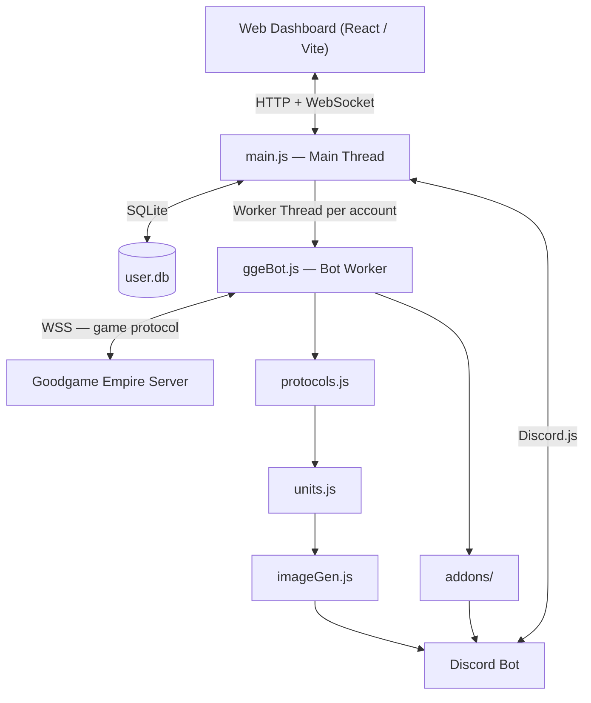

# GGE-BOT

> [!IMPORTANT]
> 📢 **هام جداً للمشتركين / Important for Subscribers**
> 
> **العربية:** هذا المستودع لا يحتوي على الإضافات الخاصة والمدفوعة (`addons-extra`) بشكل افتراضي لحمايتها. إذا كنت مشتركاً أو قمت بشراء البوت وتريد الحصول على ملفات الإضافات الخاصة، يرجى التواصل مع المطور لتفعيل الصلاحيات لك على:
> - **تيليجرام:** [@gangcard](https://t.me/gangcard)
> - **ديسكورد:** `ahmedlord4673`
>
> **English:** This public repository does not include the premium/extra plugins (`addons-extra`) by default. If you are a subscriber or have purchased the bot and want to get access to these extra plugins, please contact the developer:
> - **Telegram:** [@gangcard](https://t.me/gangcard)
> - **Discord:** `ahmedlord4673`

A self-hosted automation bot for Goodgame Empire. Runs on Node.js, has a web dashboard you control from your browser, and sends real-time attack alerts to Discord — including generated images of the incoming troop formations.

---


---

## A bit of background

I started this because I was tired of sitting in front of the game manually attacking nomads and baronies over and over. What started as a quick script turned into something considerably bigger — multi-account support, a full plugin system, a React dashboard, Discord slash commands, the whole thing.

Everything runs on your own machine. No accounts on external services, no credentials sent anywhere except to the game server itself. Your data stays in a local SQLite file on your disk.

---

## Table of Contents

- [How it works](#how-it-works)
- [System architecture](#system-architecture)
- [Files explained](#files-explained)
- [Plugin list](#plugin-list)
- [Discord setup](#discord-setup)
- [Attack images](#attack-images)
- [Database](#database)
- [Config file](#config-file)
- [Getting started](#getting-started)
- [Writing your own plugin](#writing-your-own-plugin)
- [Support](#support)

---

## How it works

The bot connects to the Goodgame Empire game server using a raw WebSocket — the same protocol the browser client uses, just driven by code instead of a human. It sends the login handshake, keeps the connection alive with periodic pings, and reacts to events from the server.

The main process (`main.js`) runs as the coordinator. It handles the web server, the database, the Discord bot, and a pool of worker threads — one thread per active game account. Each thread is independent. If one crashes or gets disconnected, only that account is affected. The main process restarts it automatically after a short delay.

Workers communicate with the main process through message passing. Log lines go up. Configuration changes come down. That's it.

```
[ Browser Dashboard ]
         |
         | HTTP + WebSocket
         |
    [ main.js ]  ------  SQLite (user.db)
         |
    Worker Threads (one per account)
         |
    [ ggeBot.js ] ---  Game Server (WSS)
         |
    [ addons/ ]  ---  Discord Bot
         |
    [ protocols.js ]
         |
    [ imageGen.js ]  --- Discord (attack images)
```

---

## System architecture



---

## Files explained

### main.js

The entry point. `node main.js` and you're running.

On startup it reads `ggeConfig.json`, validates your SSL cert and font paths, then fetches fresh data from the GGE CDN — game items, language files, and the server list (`1.xml`). After that it initialises the database, loads all plugins, starts Express, and begins accepting WebSocket connections from the dashboard.

The key structures it maintains:

```
loggedInUsers  ->  { [uuid]: [{ ws, viewedUser }] }
botMap         ->  Map<accountId, Worker>
```

When you turn an account on in the dashboard, main.js spawns a Worker thread and passes it all the account credentials and plugin configuration. If the worker exits (disconnected, error, timeout), and the account was marked active, main.js waits `secondsTillRestartBot` seconds and spawns a new one.

The `/api` route handles login and signup. The `/discordAuth` route handles the OAuth2 callback to link your Discord account to the dashboard.

---

### ggeBot.js

Runs inside each worker thread — never in the main thread. One instance per active game account.

The connection sequence:

```
1.  Open WSS to game server
2.  Send version check  ->  <msg t="sys"><body action="verChk" ...>
3.  Receive API OK      ->  send join message
4.  Receive join OK     ->  send roundTrip, then send vck (version confirm)
5.  Receive vck         ->  send lli (login) with credentials
6.  Receive lli OK      ->  wait for sei (special event info)
7.  Emit "load" event   ->  all plugins start working
```

Every outgoing command passes through a rate limiter — 5 requests per second. This stops the server from booting the account for flooding.

Error tracking: the bot counts "important errors" (bad unit configs, missing units, army limits). After 8 of them, it pauses. Consecutive timeouts are also counted — 5 in a row and the process exits so the main thread can restart it cleanly.

All `console.log/warn/error` calls inside workers are intercepted. Each message gets a timestamp and the name of the file that called it, then gets forwarded to the dashboard via parentPort.

---

### protocols.js

The biggest file in the project. Takes raw packet data from the game server and turns it into structured JavaScript objects.

What it keeps track of:

| Class | What it is |
|---|---|
| `Castle` | One castle — resources, buildings, kingdom, owner |
| `Movement` | A troop movement, incoming or outgoing |
| `Lord` | A commander with a position slot and in-use status |
| `Kingdom` | Which kingdom type this is (main, storm islands, event...) |
| `Alliance` | Alliance data attached to the player |

`movementEvents` is an EventEmitter that other modules subscribe to. When a new movement appears, updates, or returns — an event fires. Discord plugins listen to this to know when to send notifications.

---

### ggeConfig.json

Auto-generated on first run. This is the only file you need to edit manually before starting.

---

### units.js

Loads unit PNG images from the local `assets/` directory. Used by imageGen.js when building attack images.

---

### imageGen.js

Generates PNG images of attack formations. When a Discord attack notification fires, this module takes the raw troop data and draws it onto a pre-made battle layout template.

The canvas has four slots:

```
+-----------------------------------------------+
|  Left Flank  |     Front      |  Right Flank  |
|                                               |
|                  Courtyard                    |
+-----------------------------------------------+
```

Each slot can hold a grid of unit icons. Below each icon is the unit count. If the unit has a level, a small badge gets drawn over the icon. If there are more unit types than fit on the grid, it shows `...` at the end.

The whole thing runs in-process using `pureimage` — no external image tools needed.

---

## Plugin list

Plugins are the feature layer. Each one is a `.js` file that hooks into the bot's event system. The dashboard shows plugins as toggleable options per account. When you turn on an account, only the enabled plugins are loaded into that worker.

### Attack plugins

| File | Target |
|---|---|
| `attack.js` | Core attack engine — target selection, wave building, commander assignment |
| `attackNomads.js` | Nomad camps |
| `attackSamurai.js` | Samurai invasions |
| `attackKhan.js` | Khan invasions |
| `attackBerimondInvasion.js` | Berimond event |
| `attackStormForts.js` | Storm island fortresses |
| `attackBarronsGreatEmpire.js` | Great Empire baronies |
| `attackBarronsBurningSands.js` | Burning Sands baronies |
| `attackBarronsEverWinterGlacier.js` | Everwinter Glacier baronies |
| `attackBarronsFirePeaks.js` | Fire Peaks baronies |
| `attackFortressesEverWinterGlacier.js` | Everwinter Glacier fortresses |
| `attackFortressesBurningSands.js` | Burning Sands fortresses |
| `attackFortressesFirePeaks.js` | Fire Peaks fortresses |
| `sharedBarronAttackLogic.js` | Shared code for all barony plugins |
| `sharedFortressAttackLogic.js` | Shared code for all fortress plugins |

### Discord plugins

| File | What it does |
|---|---|
| `discord.js` | Sets up the Discord client inside the worker |
| `slashCommands.js` | Registers and handles slash commands |
| `incomingAttacks.js` | Notifies when the account is being attacked |
| `outgoingAttacks.js` | Logs outgoing attacks |
| `chat.js` | Mirrors in-game chat to a Discord channel |
| `aquaIsland.js` | Aquamarin island status |
| `aquaTower.js` | Aquamarin tower status |
| `fortress.js` | Fortress notifications |

### General plugins

| File | What it does |
|---|---|
| `commander.js` | Tracks commander availability, queues requests for free ones |
| `feast.js` | Automates feast participation |
| `helpRequests.js` | Handles alliance help requests |
| `intervalTimer.js` | Timed repeating actions |
| `meadReplaceStorm.js` | Replaces mead on storm island |
| `misc.js` | Always loaded — miscellaneous setup |
| `resourceSendStorm.js` | Sends resources to storm island |
| `sellStoredEquipment.js` | Sells stored equipment automatically |
| `shutoffTimer.js` | Turns the bot off after a configured duration |
| `skips.js` | Skips certain actions based on rules you configure |

---

## Discord setup

Discord is optional. If you don't fill in the token and client ID, the bot just skips all Discord functionality without breaking anything else.

To set it up:

1. Go to [discord.com/developers](https://discord.com/developers/applications) and create a new application
2. Under "Bot", create a bot and copy the token
3. Copy the client ID from the general page and the client secret from OAuth2
4. Put them in `ggeConfig.json`
5. Invite the bot to your server — it needs `Send Messages`, `View Channels`, and `Use Slash Commands`
6. In the dashboard, hit the Discord link button. It opens an OAuth2 page, you pick your guild, and the bot wires itself to your account

After that, incoming attack notifications will include generated images of the troop layout.

---

## Attack images

Here is what happens from raw data to Discord image:

```
Attack packet arrives from game server
           |
           v
  protocols.js parses it into a Movement object
           |
           v
  incomingAttacks plugin fires
           |
           v
  imageGen.createLayout(left, front, right, courtyard)
           |
           v
  loads base template (assets/asset.png)
           |
    for each unit slot:
      units.js fetches the unit icon
      draws icon at the calculated grid position
      draws count label below
      draws level badge if applicable
      truncates with "..." if grid is full
           |
           v
  encodes PNG to a stream
           |
           v
  stream sent as a Discord message attachment
```

---

## Database

Two tables in `user.db`:

**Users** — dashboard accounts

```
username       TEXT    login name (unique)
passwordHash   BLOB    PBKDF2-SHA256, 600k iterations
passwordSalt   INTEGER random 256-byte salt
uuid           TEXT    session token (unique)
privilege      INTEGER account privilege level
discordUserId  TEXT    linked Discord user ID
discordGuildId TEXT    linked Discord server ID
```

**SubUsers** — game accounts belonging to a dashboard user

```
id             INTEGER  primary key, auto increment
uuid           TEXT     which dashboard user owns this
name           TEXT     in-game account name
pass           TEXT     in-game password or login token
plugins        TEXT     JSON — enabled plugins and their settings
state          INTEGER  0 = stopped, 1 = running
externalEvent  INTEGER  connects to event server instead of main server
server         INTEGER  GGE server number
```

Passwords use PBKDF2-SHA256 at 600,000 iterations. That is well above what is currently recommended and means the hash file alone is useless to anyone who gets hold of it.

---

## Config file

`ggeConfig.json` is created automatically the first time you run the bot. These are all the fields:

```jsonc
{
  // Port for the web dashboard
  "webPort": "3001",

  // Path to a TTF font used when drawing attack images
  // If blank: Linux defaults to DejaVuSans, Windows to Segoe UI
  "fontPath": "",

  // SSL — both needed to switch to HTTPS. Leave blank for plain HTTP.
  "privateKey": "",
  "cert": "",

  // Token required to register new dashboard accounts
  // Leave blank if you want open registration (not recommended on a public server)
  "signupToken": "",

  // Discord credentials — all three needed for Discord to work
  "discordToken": "",
  "discordClientId": "",
  "discordClientSecret": "",

  // Multiplies all internal timeouts — raise this if you have a slow connection
  "timeoutMultiplier": 1,

  // How many seconds to wait before restarting a crashed worker
  "secondsTillRestartBot": 10,

  // Set to true for verbose debug output in the terminal
  "debug": false
}
```

---

## Getting started

You need Node.js v22 or later. The project uses `node:sqlite` which is built into Node from v22 — no external SQLite bindings required.

### For Windows Users (Easiest)

1. **Install & Setup:**
   Double-click the `install.bat` file in the root folder.
   - It checks if Node.js is installed. If not, it will open the download page.
   - It will install all dependencies for the bot and the dashboard automatically, initialize the submodules, and build the dashboard.

2. **Start the Bot:**
   Double-click the `start_bot.bat` file.
   - It will start the bot, and you can open `http://localhost:3001` in your browser.

### For Linux Users

**Clone and install**

```bash
git clone https://github.com/Alshrief/new-gge-bot.git
cd new-gge-bot
npm install
```

**Build the dashboard**

```bash
cd website
npm install
npm run build
cd ..
```

**Start the bot**

```bash
node main.js
```

First run will create `ggeConfig.json` and fetch game data from the GGE CDN. Then open `http://localhost:3001` in your browser.

**Create an account and add a game account**

Sign up on the dashboard, log in, click "Add Account", enter your GGE credentials, pick your server and enable the plugins you want, then toggle it on. The bot connects immediately.

---

## Private Extra Addons (addons-extra)

The `addons-extra` folder contains premium/extra plugins and is linked as a private Git Submodule. 
- If you clone the repository or download the ZIP, this folder will be empty by default.
- If you are a subscriber or have purchased these extra features, you must get access to the private repository to download them.
- To request access, please contact the developer:
  - **Telegram:** [@gangcard](https://t.me/gangcard)
  - **Discord:** `ahmedlord4673`

Once you are granted access, you can download the addons-extra repository or run:
```bash
git submodule update --init --recursive
```
to automatically pull the files on your system.

---

## Writing your own plugin

If you want something that is not in the plugin list, you can add it without touching the main codebase.

Create a `plugins-personal/` folder next to the other plugin folders, then put an `index.js` in it:

```js
// plugins-personal/index.js
module.exports = [
  ['plugins-personal/myPlugin', require('./myPlugin.js')]
]
```

Then your actual plugin file:

```js
// plugins-personal/myPlugin.js

// This block runs in the main thread during plugin discovery.
// Return early with the metadata — do not put game code here.
if (require('node:worker_threads').isMainThread) {
  return module.exports = {
    description: 'My custom plugin',
    hidden: false,
    pluginOptions: [
      { key: 'someOption', default: 'defaultValue' }
    ]
  }
}

// Everything below runs inside the worker thread.
const { xtHandler, sendXT, waitForResult, events, botConfig } = require('../ggeBot.js')

events.on('load', async () => {
  console.log('my plugin loaded, account:', botConfig.name)

  // listen to a game event
  xtHandler.on('someCommand', async (obj, result) => {
    if (result !== 0) return
    // do something with obj
  })
})

module.exports = {
  description: 'My custom plugin',
  hidden: false
}
```

The bot picks up `plugins-personal/` automatically on startup.

---

## External events

When an account has "external event" enabled, the bot does something a bit clever before connecting.

It first spawns a lightweight probe worker that connects to the main game server and asks for the active event info (`sei` and `glt` commands). Based on the response it figures out which temporary server is running — Berimond, Storm Islands, etc. — and what handshake token is needed to join it. The probe terminates, and the real worker spawns pointing directly at the event server with everything it needs already in hand.

You do not have to do anything manually for this. Just enable external event on the account and it handles the rest.

---

## Project layout

```
GGE-BOT/
├── main.js                   entry point, orchestrator
├── ggeBot.js                 worker thread, game client
├── protocols.js              protocol parser
├── units.js                  asset loader
├── imageGen.js               attack image generator
├── actions.json              IPC message type enum
├── errors.json               game error code enum
├── err.json                  extended error mapping
├── assets.json               asset metadata
├── assets/                   unit and UI images
├── addons/
│   ├── index.js              plugin discovery
│   ├── commander.js
│   ├── feast.js
│   ├── helpRequests.js
│   ├── intervalTimer.js
│   ├── meadReplaceStorm.js
│   ├── misc.js
│   ├── resourceSendStorm.js
│   ├── sellStoredEquipment.js
│   ├── shutoffTimer.js
│   ├── skips.js
│   ├── attack/               attack automation plugins
│   └── discord/              discord plugins
├── addons-extra/            optional extra plugins
├── website/
│   ├── src/                  React dashboard source
│   ├── public/locales/       translation files
│   ├── index.html
│   ├── signin.html
│   ├── signup.html
│   └── build/                production build (served by Express)
├── ggeConfig.json            config (auto-created)
├── user.db                   database (auto-created)
├── 1.xml                     server list (auto-fetched)
└── package.json
```

---

## Languages

The dashboard and bot logs support 12 languages: English, German, Arabic, Finnish, Hebrew, Hungarian, Polish, Romanian, Turkish, Czech, Dutch, and French.

Language packs are pulled from the GGE CDN on startup and cached locally in `lang/`. The locale is picked up automatically from the environment, or you can set it manually.

---

## Support

If this project saved you some time and you want to contribute back, crypto donations are welcome:

**USDT (BEP20 network)**
```
0x03544B54fAc69a1616618aABDBBe31cBDe650ED1
```

**Bitcoin (Bitcoin network)**
```
bc1ql5nlel7n96ax40ve7sg84ddqp9ha3c4jmmv9nv
```

**ETH (Ethereum network)**
```
0x03544B54fAc69a1616618aABDBBe31cBDe650ED1
```

**Solana (SOL network)**
```
GkybF55ShiLanp3sZ6w9h1u9ycQiGX7BJs7eMLLro6de
```

**Tron (TRX network)**
```
TKx9pn6eGFEEMUhr1Br5cHqHh7age4nBKU
```

**BNB Coin (BNB network)**
```
0x03544B54fAc69a1616618aABDBBe31cBDe650ED1
```

---

Repository: [github.com/Alshrief/NEW-GGE-BOT](https://github.com/Alshrief/new-gge-bot)
